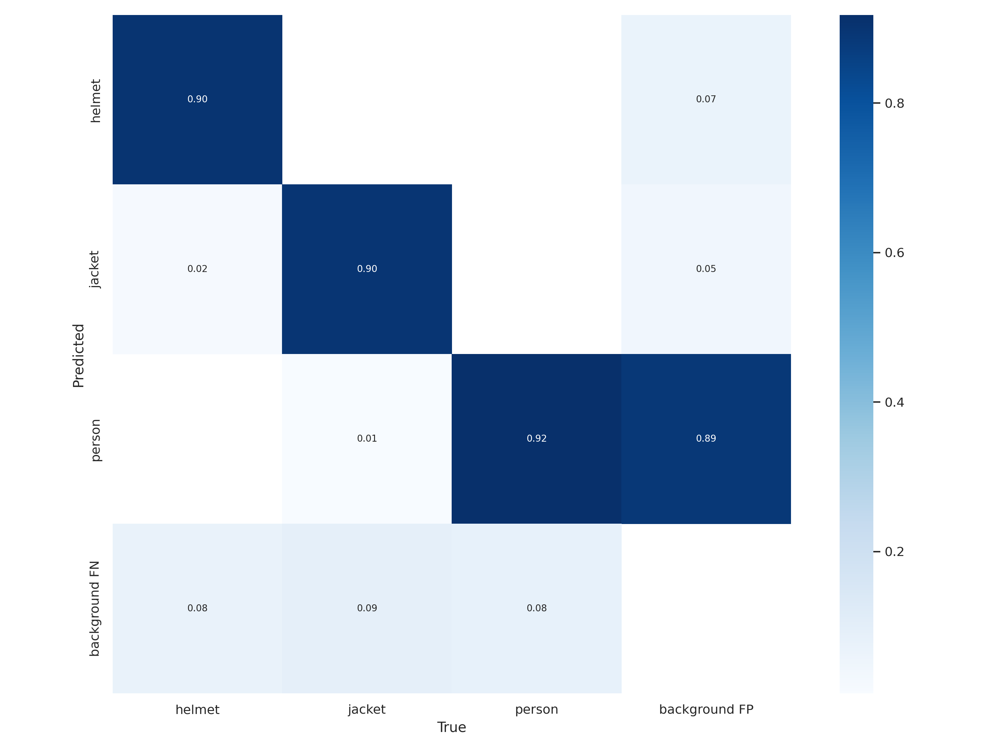
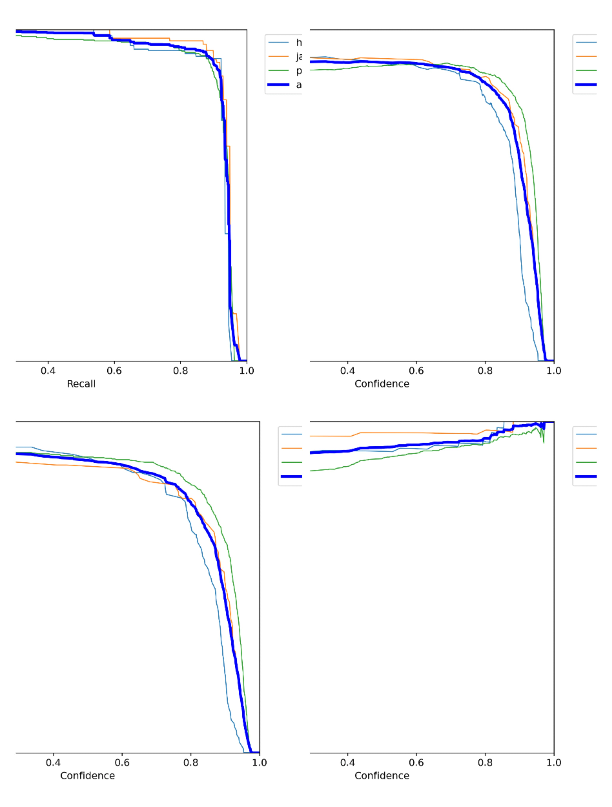
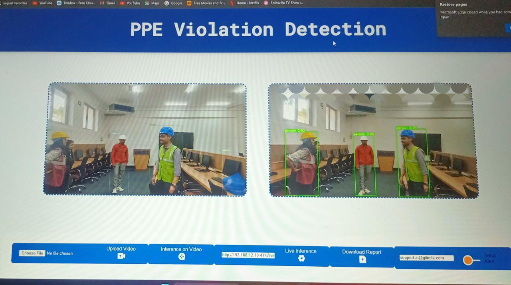
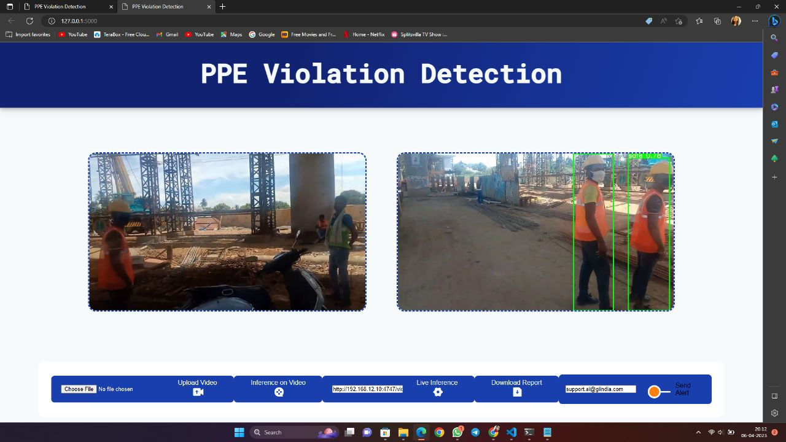

# PPE-Violation-Detection
The aim of this project was to detect PPE on a worker, and triggering email to the admin if the violation found.(safety monitoring).

# PPE Detection for Construction Site Safety using YoloV7

> 4,764 workers died on the job in 2020 (3.4 per 100,000 full-time equivalent workers). Workers in transportation and material moving occupations and construction and extraction occupations accounted for nearly half of all fatal occupational injuries (47.4 percent), representing 1,282 and 976 workplace deaths, respectively. 
>
> *Occupational Safety and Health Administration (US Department of Labour)*

## Introduction

Lack of personal protective equipment and safety gear for construction workers is leading to increased onsite fatalities and injuries among them. The aim of this project was to detect PPE on a worker, and triggering email to the admin if the violation found.(safety monitoring). We use the custom dataset collected by our team and trained on Kubeflow.(https://universe.roboflow.com/ppe-detection-csg9b/ppe-detection-siklb/dataset/2). 

For easier use the dataset is already uploaded here: (https://universe.roboflow.com/ppe-detection-csg9b/ppe-detection-siklb).

The dataset consists of 1630 image samples with labels in YoloV7 format. These images are split into `train: 1137`, `valid: 324` and `test: 169` sets. Each folder consists of `images` and `labels` folders.

There are 4 classes to detect from the dataset: 

**'no helmet', 'no jacket', 'safe', 'unsafe'**

## Setup

The code was trained on Kubeflow and run on a DGX A100 GPU. One should include client_secrets.json file in the root folder and update the sender email address in the hubconfCuston.py file with the same email having credentials.

**Note:** This repository contains all the results, visualizations and best model after custom training on the dataset.

## Results

After training, we get the following results:

## Outputs

